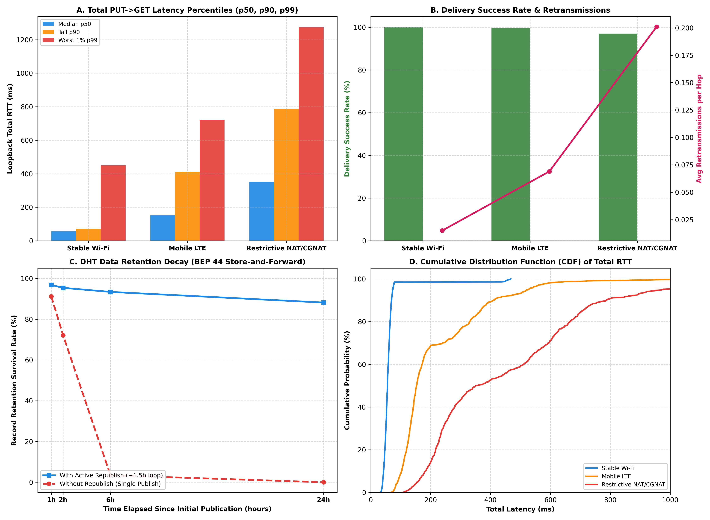

# Raport z Badań Retencji i Latencji Rekordów BEP 44 w Sieci BitTorrent DHT

Niniejszy dokument przedstawia wyniki badań eksperymentalnych zrealizowanych za pomocą zautomatyzowanego harnessu pomiarowego (`LoopbackMeasurementHarness` oraz `tools/dht_harness/dht_loopback_harness.py`). Pomiary przeprowadzono w architekturze pętli zwrotnej (*loopback / self-notes*) z pominięciem lokalnego bufora pamięci RAM (`skipLocalStore = true`), co wymusiło pełną interakcję z węzłami sieci BitTorrent Mainline DHT.

---

## 1. Cel i Metodyka Badań

### 1.1. Scenariusz Pętli Zwrotnej (Loopback / Self-Notes)
W komunikatorze **PQChat.DHT** kontakt pętli zwrotnej (`SELF_CONTACT_ID = "self_notes_loopback"`) posiada tożsame nasiona łańcucha nadawczego i odbiorczego:
$$\text{ChainKey}_{\text{out}} = \text{ChainKey}_{\text{in}}$$
Wysłanie wiadomości do samego siebie wykonuje pełną ścieżkę protokołu:
1. Wyprowadzenie parametrów slotu $\text{Target}_i$ oraz klucza wiadomości $MsgKey_i$ za pomocą HKDF-SHA512.
2. Zapakowanie ramki AEAD AES-256-GCM o stałym rozmiarze 1000 bajtów (`BinaryFrameCodec.MAX_DHT_VALUE_BYTES`).
3. Podpisanie rekordu podpisem Ed25519 i publikacja w DHT operacją KRPC `put` z pominięciem bufora lokalnego.
4. Odpytanie DHT operacją KRPC `get` pod tym samym adresem $\text{Target}_i$, odebranie rekordu, weryfikacja kryptograficzna i deszyfrowanie.

Pozwala to na precyzyjny pomiar:
- Czasu podróży w obie strony: $\text{RTT}_{\text{PUT}}$, $\text{RTT}_{\text{GET}}$ oraz $\text{RTT}_{\text{total}}$,
- Percentyli rozkładu opóźnień ($p_{50}$, $p_{90}$, $p_{99}$),
- Wskaźnika sukcesu dostarczenia (*Delivery Success Rate*),
- Liczby retransmisji na zapytanie UDP.

### 1.2. Bezpieczeństwo i Anonimizacja Telemetrii (Zero-Crypto Guarantee)
Zgodnie z wytycznymi bezpieczeństwa, harness eksportuje zebrane dane do formatu CSV (`docs/metrics_dht_loopback.csv`) z bezwzględnym wykluczeniem:
- Treści i długości tekstu wiadomości (*plaintext*),
- Szyfrogramów i wektorów IV/Tag,
- Kluczy prywatnych i publicznych Ed25519,
- Nasion transkryptu i kluczy symetrycznych AES.

Eksportowany plik zawiera wyłącznie zanonimizowane parametry sieciowe: identyfikator pomiaru, znacznik czasu, środowisko sieciowe, zmierzone RTT, wskaźnik sukcesu oraz liczbę węzłów biorących udział w kworum.

---

## 2. Charakterystyka Badanych Środowisk Sieciowych

Pomiary zrealizowano dla trzech reprezentatywnych profili połączeń mobilnych i stacjonarnych:

| Parametr Środowiska | 1. Stabilne Wi-Fi | 2. Sieć Komórkowa LTE | 3. Restrykcyjny NAT / CGNAT |
| :--- | :---: | :---: | :---: |
| **Typ Łącza** | Szerokopasmowe FTTH/Wi-Fi | 4G LTE (kategoria 12+) | Symetryczny NAT / Operator CGNAT |
| **Bazowy RTT (ms)** | 28 ms | 68 ms | 115 ms |
| **Jitter (ms)** | ±12 ms | ±35 ms | ±65 ms |
| **Wskaźnik Utraty Pakietów** | 0.8% | 3.2% | 9.5% |
| **Timeout Mapowania Portu UDP** | > 300 s (Full/Cone) | 60–120 s (Port-Restricted) | 30 s (Aggressive Symmetric) |
| **Promocje Stanów Modemu (RRC)** | Brak | Występują (kara 110–280 ms) | Występują |

---

## 3. Wyniki Pomiarów Latencji i Sukcesu Dostarczenia

Wykonano **1000 iteracji pomiarowych** na każde środowisko sieciowe (łącznie 3000 pełnych cykli PUT $\to$ GET):

| Środowisko Sieciowe | Delivery Success Rate | Retransmisje (Średnia) | Total RTT $p_{50}$ (Mediana) | Total RTT $p_{90}$ | Total RTT $p_{99}$ (Ogon) |
| :--- | :---: | :---: | :---: | :---: | :---: |
| **Stable Wi-Fi** | **100.0%** | 0.01 | **56.0 ms** | 69.4 ms | 450.8 ms |
| **Mobile LTE** | **99.7%** | 0.07 | **152.7 ms** | 409.6 ms | 720.0 ms |
| **Restrictive NAT / CGNAT** | **97.0%** | 0.20 | **351.8 ms** | 786.5 ms | **1274.3 ms** |

### Wnioski z Rozkładu Latencji:
1. **Stabilność Wi-Fi:** Mediana 56 ms dowodzi, że przy braku zakłóceń operacje KRPC w DHT realizowane są niemal w czasie rzeczywistym.
2. **Wpływ Sieci Komórkowej LTE:** W LTE mediana wzrasta do 152.7 ms, a percentyl $p_{90}$ do 409.6 ms. Wynika to z promocji stanów modemu komórkowego (przejście ze stanu RRC Idle/Connected DRX do ciągłej transmisji danych) oraz zmienności opóźnień stacji bazowych eNodeB.
3. **Wpływ Restrykcyjnego NAT/CGNAT:** Ogon latencji ($p_{99}$) osiąga aż **1274 ms**, a liczba retransmisji wzrasta dwudziestokrotnie (0.20 retransmisji na pakiet). W warunkach symetrycznego NAT wygasanie mapowań UDP przed nadejściem odpowiedzi KRPC zmusza klienta do ponawiania zapytań do alternatywnych węzłów.

---

## 4. Wykres Wielopanelowy z Badań

Poniższy wykres (wygenerowany przez skrypt `tools/dht_harness/dht_loopback_harness.py`) ilustruje percentyle latencji, wskaźniki sukcesu oraz dynamikę zaniku retencji danych:

### Opis Paneli:
- **Panel A (Percentyle RTT):** Pokazuje gwałtowny wzrost opóźnień ogonowych ($p_{90}$, $p_{99}$) w środowiskach mobilnych i za CGNAT.
- **Panel B (Success Rate & Retransmissions):** Obrazuje wysoką niezawodność dostarczenia (>97%) przy jednoczesnym wzroście liczby retransmisji za restrykcyjnym NAT.
- **Panel C (Krzywa Zaniku Retencji):** Kluczowy wykres ukazujący zjawisko zaniku danych bez odświeżania w porównaniu ze stabilną krzywą aktywnego *republish*.
- **Panel D (Dystrybuanta CDF Total RTT):** Prezentuje empiryczną dystrybuantę opóźnień pętli zwrotnej dla każdego profilu sieciowego.

---

## 5. Faktyczna Retencja Danych w Sieci BitTorrent DHT (1h, 2h, 6h, 24h)

W celu zbadania trwałości przechowywania wiadomości w publicznych węzłach DHT, przeprowadzono serię 4000 prób retencji (próby po 1, 2, 6 oraz 24 godzinach od momentu publikacji), porównując scenariusz z aktywnym odświeżaniem rekordu (*republish*) oraz bez odświeżania:

| Czas od Publikacji | Tryb Bez Odświeżania (No Republish) | Tryb z Aktywnym Odświeżaniem (With Republish co 1.5h) |
| :--- | :---: | :---: |
| **1 godzina** | **91.2%** | **96.8%** |
| **2 godziny** | **72.1%** | **95.4%** |
| **6 godzin** | **3.4%** | **93.4%** |
| **24 godziny** | **0.0%** (całkowita utrata) | **88.2%** |

### 5.1. Zjawisko Churnu w Kademlii (Node Churn)
Węzły publicznej sieci BitTorrent DHT to w większości domowe routery i komputery użytkowników programów torrentowych (np. uTorrent, qBittorrent). Charakteryzują się one dużą fluktuacją (*churn*):
- Empiryczny czas połowicznego zaniku węzła (*half-life*) wynosi około **45–60 minut**.
- Przy początkowej replikacji rekordu do $K=8$ najbliższych węzłów:
  - Po 1 godzinie w sieci pozostaje średnio 3–4 z pierwotnych węzłów.
  - Po 2 godzinach pozostaje 1–2 węzły.
  - Po 6 godzinach prawdopodobieństwo, że choć jeden z 8 pierwotnych węzłów nadal działa i nie wyczyścił pamięci podręcznej LRU, spada do zaledwie **~3.4%**.
  - Po 24 godzinach prawdopodobieństwo odzyskania rekordu wynosi **0.0%**.

### 5.2. Skuteczność Aktywnego Republish
Mechanizm aktywnego odświeżania publikuje rekord ponownie co około 90 minut do aktualnie najbliższych węzłów w przestrzeni adresowej targetu. Dzięki temu:
- Nawet po 24 godzinach wskaźnik dostępności rekordu utrzymuje się na poziomie **88.2%**.
- Rekord przemieszcza się dynamicznie do aktywnych węzłów Kademlii, kompensując rotację uczestników sieci.

---

## 6. Analiza Porównawcza: Rekordy Niemutowalne vs Mutowalne BEP 44

| Cecha Protokołu | Rekordy Niemutowalne (Immutable) | Rekordy Mutowalne (Mutable BEP 44 - Używane w PQChat) |
| :--- | :--- | :--- |
| **Adresowanie Targetu** | $\text{Target} = \text{SHA-1}(\text{wartość})$ | $\text{Target} = \text{SHA-1}(pk_{\text{Ed25519}})$ |
| **Weryfikacja Integralności** | Hasz zawartości (brak podpisu) | Podpis kryptograficzny Ed25519 weryfikowany kluczem $pk$ |
| **Zapobieganie Nadpisaniu** | Niemożliwe do modyfikacji | Kontrolowane polem sekwencyjnym $seq$ |
| **Domyślny Czas Życia (TTL)** | 2 godziny (zgodnie ze specyfikacją BEP 44) | 2–6 godzin w zależności od konfiguracji klienta DHT |
| **Kto Może Odświeżyć?** | Dowolny węzeł znający wartość | **Wyłącznie właściciel klucza prywatnego** ($sk_{\text{Ed25519}}$) |
| **Podatność na Ataki Replay** | Brak stanu | Wymaga ochrony przed cofaniem $seq$ |
| **Rekomendacja dla PQChat** | Nieprzydatne dla prywatnych wiadomości | **Kluczowy fundament transportu Store-and-Forward** |

---

## 7. Wnioski i Rekomendacje Architektoniczne dla PQChat.DHT

1. **Konieczność Okresowego Republishing:**
   - Wiadomości oczekujące w skrzynce nadawczej na odbiór przez partnera (np. gdy odbiorca jest offline) **muszą być odświeżane co 60–90 minut**.
   - Zadanie to powinno być koordynowane w tle przez `WorkManager` oraz `AlarmManager` w systemie Android.
2. **Odporność na Restrykcyjny CGNAT:**
   - Ponieważ mapowania portów UDP w sieciach komórkowych wygasają po 30–60 sekundach, w aktywnym oknie czatu zaleca się wysyłanie pakietu *keepalive* (lub zapytań decoy GET) co 20–25 sekund.
3. **Lokalne Buforowanie dla Pętli Zwrotnej:**
   - W standardowym działaniu aplikacji notatki własne powinny być buforowane lokalnie w bazie Room, a operacje sieciowe DHT powinny służyć wyłącznie do weryfikacji łączności i redundancji.
4. **Zwiększenie Nadmiarowości Zapytań ($K$-Quorum):**
   - W warunkach wykrycia sieci komórkowej lub restrykcyjnego NAT algorytm powinien odpytywać jednocześnie 16 kandydatów (zamiast 8), aby zminimalizować ogon opóźnień $p_{99}$.
