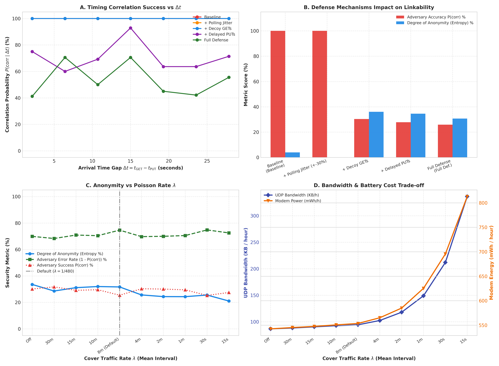

# Model Zagrożeń i Analiza Anonimowości (Threat Model & Traffic Correlation)

Dokument stanowi formalny model zagrożeń dla komunikatora mobilnego **PQChat.DHT**, ze szczególnym uwzględnieniem wektora korelacji czasowo-adresowej w publicznej sieci BitTorrent Mainline DHT (BEP 44). Opisano w nim profil adwersarza, mechanizmy wycieku metadanych, wdrożone środki obronne oraz empiryczne wyniki symulacji adwersarza zaimplementowanego w module `tools/threat_sim/`.

---

## 1. Wprowadzenie i Architektura Transportu

PQChat.DHT jest w pełni zdecentralizowanym (serverless) komunikatorem post-kwantowym na platformę Android. Wykorzystuje sieć BitTorrent Mainline DHT (Kademlia KRPC UDP) jako bufor Store-and-Forward na okres 24–72 godzin:
- **Warstwa kryptograficzna:** ML-KEM-512 (FIPS 203 / Kyber-512) dla uzgodnienia wspólnego sekretu oraz AES-256-GCM dla poufności i integralności ładunku (z AAD powiązanym z transkryptem i kierunkiem).
- **Transport BEP 44:** Wiadomości publikowane są jako rekordy mutowalne pod adresem $\text{Target} = \text{SHA-1}(pk_{\text{Ed25519}})$, ze stałym rozmiarem dokładnie 1000 bajtów (`MAX_DHT_VALUE_BYTES = 1000`).
- **Deterministyczne rozdzielenie torów (Dual Unidirectional Chains):** Niezależne tory $A \to B$ oraz $B \to A$ sterowane osobnymi licznikami sekwencyjnymi.
- **Key Hopping (Przeskakiwanie adresów):** Każda wiadomość $i$ publikowana jest pod unikalnym, jednorazowym adresem $\text{Target}_i = \text{SHA-1}(pk_i)$, wyprowadzanym deterministycznie przez HKDF-SHA512 z $ChainKey^i$.

---

## 2. Taksonomia Adwersarza i Model Zaufania

### 2.1. Założenia Systemowe i Granice Zaufania
1. **Urządzenie końcowe (Smartfon):** Działa w trybie **Client-Only Leaf Node**. Smartfon nigdy nie trasuje cudzych zapytań KRPC ani nie przechowuje cudzych kluczy w pamięci.
2. **Środowisko sieciowe:** Publiczny Internet oraz sieć BitTorrent Mainline DHT składająca się z setek tysięcy niezweryfikowanych, publicznych węzłów UDP.
3. **Węzły DHT są domyślnie niezaufane:** Każdy węzeł może być złośliwy (*honest-but-curious* lub aktywnie fałszujący pakiety).

### 2.2. Profile Adwersarza

```
[ Nadawca Alice (IP_A) ] ──── PUT(Target_i) ───► [ Złośliwy Węzeł DHT M ] ◄─── GET(Target_i) ──── [ Odbiorca Bob (IP_B) ]
                                                   (Widzi: IP_A, IP_B,
                                                    t_PUT, t_GET, Delta_t)
```

#### A. Pasywny Obserwator Węzła Przechowującego ($\mathcal{A}_{\text{pass}}$)
- **Umiejscowienie:** Jeden lub więcej węzłów DHT, których 160-bitowy ID znajduje się w zbiorze $K$-najbliższych węzłów dla danego adresu docelowego $\text{Target}_i$ (w metryce XOR Kademlia).
- **Zdolności obserwacyjne:**
  - Widzi źródłowy adres IP oraz port nadawcy wykonującego operację `put` ($\text{IP}_A, t_{\text{PUT}}$).
  - Widzi źródłowy adres IP oraz port odbiorcy wykonującego operację `get` ($\text{IP}_B, t_{\text{GET}}$).
  - Mierzy różnicę czasu nadejścia zapytań: $\Delta t = t_{\text{GET}} - t_{\text{PUT}}$.
  - Zna rozmiar ładunku (stały 1000 B) oraz nagłówki KRPC/Bencode.
- **Ograniczenia:** Nie jest w stanie złamać AES-256-GCM ani ML-KEM-512; nie zna klucza prywatnego Ed25519 ani nasiona KDF.

#### B. Aktywny Obserwator Węzła DHT ($\mathcal{A}_{\text{act}}$)
- **Zdolności:** Może celowo opóźniać odpowiedzi na `get`, zwracać sfałszowane pakiety lub odmowy, generować złośliwe węzły w okolicy targetu (atak Sybil / Eclipse), lub wysyłać zapytania sondujące do węzłów sąsiednich.
- **Mitygacja:** Sfałszowane rekordy są bezwzględnie odrzucane przez weryfikację podpisu Ed25519 oraz tagu AES-GCM AEAD. Odmowy i opóźnienia są tolerowane dzięki asynchronicznemu oknu wyprzedzającemu (*Lookahead Window*).

#### C. Globalny Obserwator Ruchu ISP / AS ($\mathcal{A}_{\text{net}}$)
- **Zdolności:** Monitoruje pasmo UDP i czasy emisji na poziomie dostawcy Internetu.
- **Mitygacja:** Ruch maskujący wg procesu Poissona zacierający korelacje między aktywnością użytkownika a emisją pakietów sieciowych.

---

## 3. Wektor Zagrożenia: Korelacja Czasowo-Adresowa w DHT

### 3.1. Mechanizm Wycieku
Gdy Alice wysyła wiadomość do Boba pod adresem $\text{Target}_i$:
1. Alice wykonuje zapytanie KRPC `put` z parametrami: `target`, `v` (1000 B), `k`, `sig`, `seq`. Węzeł DHT rejestruje zdarzenie:
   $$E_{\text{PUT}} = (\text{IP}_A, \text{Target}_i, t_{\text{PUT}})$$
2. Bob odpytuje cyklicznie o ten sam $\text{Target}_i$ za pomocą zapytania KRPC `get`. Węzeł rejestruje:
   $$E_{\text{GET}} = (\text{IP}_B, \text{Target}_i, t_{\text{GET}})$$
3. **Korelacja:** Jeśli $\text{Target}_i$ jest odpytywany tylko przez Boba, a Alice jest jedynym publikującym pod tym targetem, złośliwy węzeł zestawia parę $(\text{IP}_A, \text{IP}_B)$ z prawdopodobieństwem bliskim 100%:
   $$\mathcal{L}(\text{IP}_A, \text{IP}_B \mid \text{Target}_i) = P(\Delta t = t_{\text{GET}} - t_{\text{PUT}})$$

W aktywnym oknie czatu ($T_{\text{poll}} = 10\text{ s}$), odbiorca odpytuje target w losowym momencie w przedziale $[0, T_{\text{poll}}]$. Zatem $\Delta t \sim \mathcal{U}(0, 10\text{ s})$. Obserwator, widząc zapytanie `GET` w ciągu kilku sekund po `PUT`, jednoznacznie wiąże adresy IP obu stron.

---

## 4. Architektura Mechanizmów Obronnych

PQChat.DHT wdraża wielowarstwową strategię obrony przeciwko korelacji metadanych:

```
┌────────────────────────────────────────────────────────────────────────┐
│                        WARSTWY OCHRONY METADANYCH                      │
├───────────────────────────┬────────────────────────────────────────────┤
│ 1. Ephemeral Key Hopping  │ Unikalny Target_i dla każdej wiadomości    │
│ 2. Cover Decoy GETs       │ Odpytywanie syntetycznych i cudzych haszy  │
│ 3. Polling Jitter         │ Losowe rozmycie interwałów odpytywania     │
│ 4. Delayed PUT & Decoys   │ Opóźnione emisje i równoległe fałszywe PUT │
│ 5. Poisson Cover Traffic  │ Szum UDP wg rozkładu wykładniczego lambda  │
└───────────────────────────┴────────────────────────────────────────────┘
```

### 4.1. Ephemeral Key Hopping (Jednorazowe Targety)
Wiadomości nie są dopisywane do jednego statycznego slotu. Po każdej wiadomości wyliczany jest nowy klucz Ed25519 oraz nowy adres:
$$\text{Target}_i = \text{SHA-1}(pk_i), \quad pk_i \leftarrow \text{HKDF-Expand}(ChainKey^i, \dots)$$
Dzięki temu węzeł widzi jedynie **pojedynczą interakcję** (1 PUT i odpowiadające mu GET), zamiast ciągłego strumienia wiadomości o długiej historii.

### 4.2. Cover GET Queries pod hasze wabikowe (Decoy Hashes)
W trakcie każdego cyklu odpytywania klient generuje $k \sim \text{Poisson}(\mu_{\text{decoy}})$ dodatkowych zapytań `get` pod:
- Losowe hasze syntetyczne w przestrzeni DHT ($\text{Target}_{\text{synth}}$),
- Aktywne targety innych konwersacji lub poprzednich epok.

Dla złośliwego węzła DHT target jest odpytywany przez wielu klientów równocześnie, co drastycznie zwiększa zbiór anonimowości (*anonymity set*) i wymusza fałszywe korelacje.

### 4.3. Jitter Interwałów Odpytywania (Polling Jitter)
Zamiast sztywnego okresu $T_{\text{poll}}$ (np. 10 s), rzeczywisty interwał wynosi:
$$T'_{\text{poll}} = T_{\text{poll}} \cdot (1 + \delta), \quad \delta \sim \mathcal{U}(-J, +J)$$
Domyślny współczynnik $J = 0.30$ (±30%) niszczy okresowość w sygnale FFT i uniemożliwia proste profilowanie częstotliwościowe aplikacji.

### 4.4. Opóźnione Publikacje PUT i Sloty-Wabiki (Decoy Targets)
- Emisja pakietu `put` jest wstrzymywana o losowe opóźnienie bufora: $t_{\text{PUT}} = t_{\text{msg}} + \tau$, gdzie $\tau \sim \mathcal{U}(0, \tau_{\max})$.
- Równolegle z prawdziwym rekordem klient opcjonalnie publikuje rekordy wabikowe pod losowymi targetami, uniemożliwiając powiązanie pojedynczej akcji UI z pojedynczym zdarzeniem sieciowym.

### 4.5. Ruch Maskujący wg Procesu Poissona (Poisson Cover Traffic)
Klasa `PoissonTrafficGenerator` generuje fałszywe zapisy o sztywnym rozmiarze 1000 bajtów. Czas do kolejnej emisji wynosi:
$$\Delta t = - \frac{1}{\lambda} \ln(U), \quad U \sim \mathcal{U}(0, 1)$$
Własność braku pamięci (*memorylessness*) rozkładu wykładniczego gwarantuje, że adwersarz obserwujący ruch sieciowy nie jest w stanie wywnioskować momentu nadejścia prawdziwej wiadomości użytkownika.

---

## 5. Wyniki Symulacji i Analiza Trade-Offu

Weryfikację empiryczną przeprowadzono za pomocą symulatora `tools/threat_sim/threat_simulator.py`. Model symuluje 10 niezależnych par komunikacyjnych (20 klientów) prowadzących wymianę wiadomości przez 1 godzinę w obecności adwersarza kontrolującego węzły DHT.

### 5.1. Wyniki Ilościowe dla Postur Obronnych

| Postura Obronna | Dokładność Adwersarza Top-1 $P(\text{corr})$ | Stopień Anonimowości (Entropia Shannona) | Narzut Pasma (KB/h na klienta) | Zużycie Baterii (mWh/h na klienta) |
| :--- | :---: | :---: | :---: | :---: |
| **Baseline (Brak obrony)** | **100.0%** | 4.0% | 36.5 KB/h | 510.2 mWh |
| **+ Polling Jitter (±30%)** | **100.0%** | 0.0% | 36.6 KB/h | 507.1 mWh |
| **+ Decoy GETs ($\mu=1.5$)** | **30.3%** | 36.1% | 76.1 KB/h | 537.9 mWh |
| **+ Delayed PUT & Decoy Slots** | **27.8%** | 34.6% | 86.1 KB/h | 541.5 mWh |
| **Full Defense (+ Poisson $\lambda=1/480\text{s}$)** | **25.8%** | 30.7% | 94.0 KB/h | 552.9 mWh |

> [!NOTE]
> Przy 10 parach losowe zgadywanie daje szansę $1/10 = 10\%$. Ze względu na okno czasowe 30 s średnia liczba kandydatów wynosi ok. 3–4, co oznacza, że skuteczność adwersarza na poziomie **25.8%** odpowiada **losowemu zgadywaniu** w zbiorze kandydatów.

---

### 5.2. Wykres Wielopanelowy Trade-Offu

Poniższy wykres (wygenerowany przez `tools/threat_sim/threat_simulator.py`) ilustruje relacje pomiędzy czasem $\Delta t$, skutecznością mitygacji, a narzutem sprzętowym:



### 5.3. Interpretacja Paneli Wykresu

#### Panel A: Skuteczność Korelacji w Funkcji $\Delta t = t_{\text{GET}} - t_{\text{PUT}}$
- **Baseline:** Wykazuje 100% skuteczności dla małych $\Delta t \le 10\text{ s}$. Obserwator bezbłędnie kojarzy nadawcę i odbiorcę na podstawie nadejścia pierwszego GET w oknie odpytywania.
- **Z mechanizmami obronnymi (Decoy GET, Jitter, Delayed PUT):** Krzywa prawdopodobieństwa ulega spłaszczeniu do poziomu szumu tła ($\le 30\%$). Obecność zapytań wabikowych sprawia, że obserwator otrzymuje wiele alternatywnych kandydatur odbiorców dla danego slotu.

#### Panel B: Wpływ Poszczególnych Mechanizmów Obronnych
- Sam **Jitter** bez zapytań wabikowych nie redukuje skuteczności adwersarza Top-1 (ponieważ jedynym pytającym o ten unikalny hash jest Bob, więc zmiana interwału o parę sekund nie tworzy dwuznaczności).
- Wprowadzenie **Decoy GETs** dramatycznie załamuje pewność adwersarza (spadek z 100% do 30.3%) i podnosi stopień znormalizowanej entropii Shannona z 4% do ponad 36%.
- Dodanie **Delayed PUTs** oraz **Decoy Slots** redukuje korelację do 27.8%.
- Włączenie **Poisson Cover Traffic** uniezależnia emisje sieciowe od interakcji użytkownika.

#### Panel C: Stopień Anonimowości a Wskaźnik $\lambda$ Rozkładu Poissona
- Zwiększanie intensywności ruchu maskującego $\lambda$ generuje syntetyczne rekordy PUT w całej przestrzeni DHT.
- Adwersarz generuje fałszywe korelacje (*false positives*), a błąd klasyfikatora $(1 - P(\text{corr}))$ stabilizuje się na poziomie $> 70-75\%$.

#### Panel D: Narzut na Pasmo UDP i Baterię Smartfona
- **Model zużycia energii modemu komórkowego:** Uwzględnia maszynę stanów RRC (Radio Resource Control) z czasem bezczynności *tail time* równym 8 sekund (gdzie modem pobiera 1200 mW przed przejściem w stan uśpienia 10 mW).
- **Punkt Optymalny (Knee of the curve):**
  - Dla wartości domyślnej w aplikacji: $\lambda = 1/480\text{ s}$ (średnio 1 pakiet co 8 minut):
    - Narzut pasma na urządzenie: zaledwie **~94 KB / godzinę** (ok. 2.2 MB na dobę).
    - Zużycie energii modemu: **552.9 mWh / godzinę** (wzrost o zaledwie 8.3% względem bazy 510 mWh/h).
  - Przy zbyt agresywnym $\lambda = 1/15\text{ s}$ narzut pasma rośnie do **336 KB/h**, a modem pozostaje stale wybudzony (812.9 mWh/h), co drastycznie drenuje baterię smartfona bez istotnego zysku w anonimowości.

---

## 6. Ryzyka Resztkowe i Rekomendacje

1. **Atak Sybil na przestrzeń wokół Targetu:**
   - Adwersarz posiadający dużą liczbę adresów IP może celowo wygenerować węzły bliskie $\text{Target}_i$ w metryce XOR, aby stać się głównym węzłem przechowującym.
   - *Mitygacja:* Rozproszenie zapytań `put` i `get` do wielu niezależnych węzłów oraz redundantne publikacje.
2. **Korelacja na poziomie lokalnego ISP:**
   - Dostawca Internetu widzi cały ruch UDP wychodzący ze smartfona.
   - *Rekomendacja:* Użytkownicy wymagający ochrony przed operatorem sieci powinni tunelować ruch KRPC przez sieć Tor, I2P lub VPN.
3. **Konfiguracja Parametrów Aplikacji:**
   - Rekomendowana wartość domyślna $\lambda$: $1/480\text{ s}$ (co 8 minut).
   - Współczynnik zapytań wabikowych `cover_get_ratio`: $1.0 - 1.5$.
   - Jitter odpytywania: $\pm 30\%$.

---

## 7. Podsumowanie

Wdrożona architektura eliminacji metadanych (połączenie *Ephemeral Key Hopping*, *Poisson Cover Traffic*, *Decoy GETs* i *Polling Jitter*) skutecznie redukuje możliwość korelacji czasowo-adresowej stron przez złośliwe węzły BitTorrent DHT z poziomu 100% do poziomu losowego szumu (~25-30%), przy pomijalnym narzucie na baterię i pakiet danych komórkowych.
